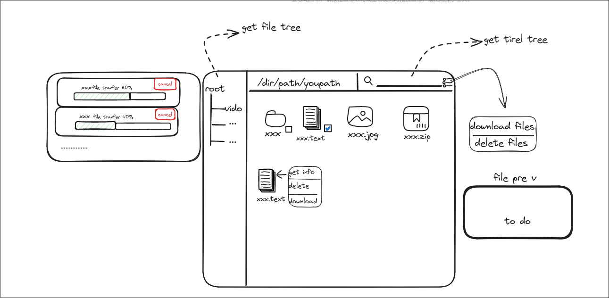

# 需求分析

主要功能：

- [ ] 在网络下上传和下载文件
- [ ] 分配用户权限， . 普通用户只可以从库中读取和下载文件 .
   管理员用户可以上传和修改库中的文件
- [ ] 主要通过http访问网站的形式交互
- [ ] 支持多线程下载
- [ ] 使用连接池进行连接的分配和回收
- [ ] 日志记录
- [ ] 在文件搜索时，搜索通过字典树实现

日志功能：

- [ ] 日志格式 ：日志级别 + time/day/month/year + message
- [ ] 日志输出到具体文件
- [ ] 单文件日志大小 超过了创建新的日志文件 设置具体时间 更换日志

拓展:

- [ ] 用户登录 注册
- [ ] 用户之间传输文件
- [ ] ......
